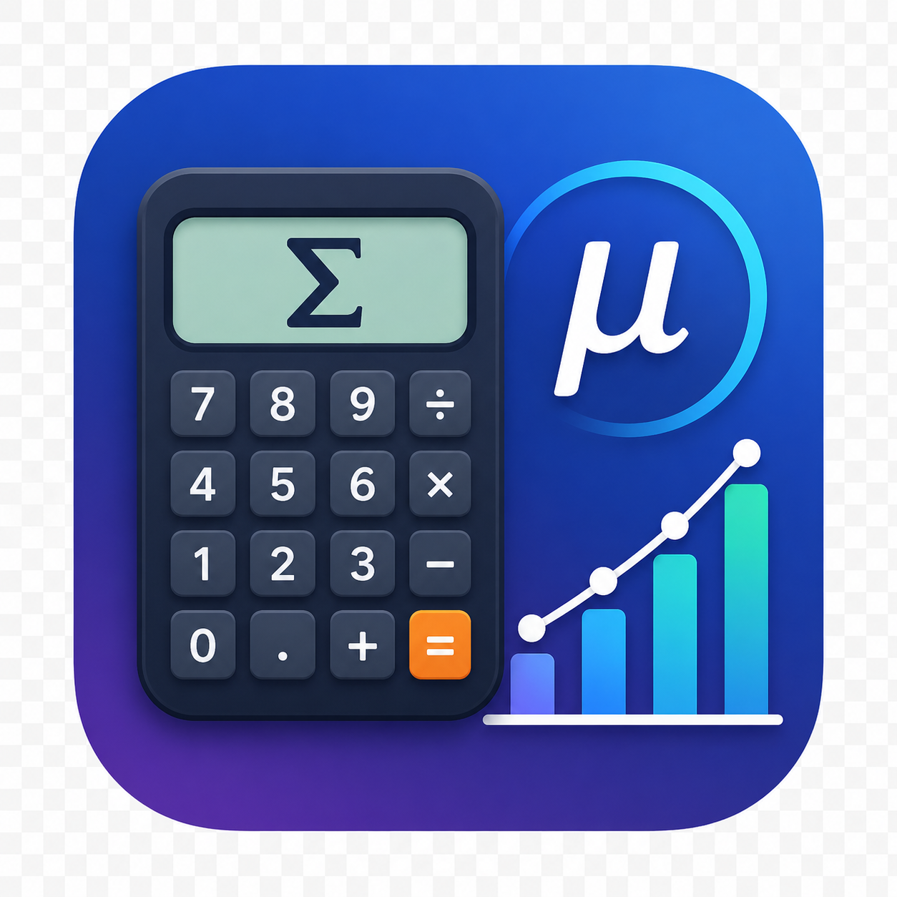

# Q-Calc

期待値を逐次平均で計算する、個人用の小さな raylib アプリです。



## 概要

入力した値を 1 件ずつ確定し、以下の式で期待値を更新します。

```text
R = R + (reward - R) / n
```

- `reward`: 今回入力した値
- `n`: 確定済み入力回数
- `R`: 現在の期待値

現在の実装では、UI から入力できる値は `0` から `9` の数字列です。小数点や負数の入力 UI はありません。

## 対応環境

このリポジトリに含まれる `expected_app` は、Linux 上でビルドされた Linux 用の実行ファイルです。

- Linux x86-64 向け ELF 実行ファイルです。
- `libraylib.so.550` などの Linux 上の共有ライブラリに動的リンクしています。
- Windows / macOS ではそのまま実行できません。
- 他の OS で使う場合は、その OS 上で raylib を用意して別途ビルドしてください。

## 依存関係

- C++20 対応コンパイラ
- raylib
- pkg-config

この環境では以下でビルド確認しています。

- GCC 16.1.1
- raylib 5.5.0

## ビルド

Linux 上で以下を実行します。

```sh
g++ -std=c++20 main.cpp -o expected_app $(pkg-config --cflags --libs raylib)
```

このプロジェクトには現在 CMake などのビルド設定はありません。ソースは `main.cpp` の単一ファイルです。

## 実行

```sh
./expected_app
```

Linux 以外で利用したい場合は、ビルド済みの `expected_app` を使い回さず、対象 OS 上で再ビルドしてください。

## 操作方法

- 数字キー `0` - `9`: 入力
- テンキー `0` - `9`: 入力
- `Enter`: 入力値を確定
- `Backspace`: 1 文字削除
- `R`: リセット
- 画面上の数字ボタン: 入力
- `Enter` ボタン: 入力値を確定
- `Reset` ボタン: リセット

## ライセンス

MIT License です。詳細は [LICENSE](LICENSE) を参照してください。
